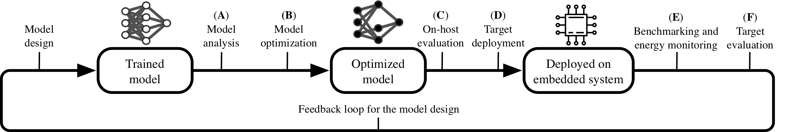

# Measuring what Really Matters: Optimizing Neural Networks for TinyML - Toolchain

This repository contains multiple Jupyter notebooks which were used for the implementation part of the paper *[Measuring what Really Matters: Optimizing Neural Networks for TinyML](https://arxiv.org/abs/2104.10645)*.

## Abstract

> With the surge of inexpensive computational and memory resources, neural networks (NNs) have experienced an unprecedented growth in architectural and computational complexity. Introducing NNs to resource-constrained devices enables cost-efficient deployments, widespread availability, and the preservation of sensitive data.
> This work addresses the challenges of bringing Machine Learning to MCUs, where we focus on the ubiquitous ARM Cortex-M architecture. The detailed effects and trade-offs that optimization methods, software frameworks, and MCU hardware architecture have on key performance metrics such as inference latency and energy consumption have not been previously studied in depth for state-of-the-art frameworks such as TensorFlow Lite Micro. We find that empirical investigations which measure the perceptible metrics — performance as experienced by the user — are indispensable, as the impact of specialized instructions and layer types can be subtle. To this end, we propose an implementation-aware design as a cost-effective method for verification and benchmarking. Employing our developed toolchain, we demonstrate how existing NN deployments on resource-constrained devices can be improved by systematically optimizing NNs to their targeted application scenario.

## Overview

The toolchain includes portable benchmarking tools to quantify, analyze and optimize NNs by deploying them directly on MCUs. All stages can be used individually and allow an iterative design process.
Our methodology enables the investigation of key performance metrics such as inference latency and energy consumption, gathering insights on the perceptible as well as standard metrics down to layer-wise granularity. An optional feedback of these results for the model design permits a cost-efficient, implementation-aware NAS.



The notebooks are meant to be used in a consecutive order as outlined in the methods section. 
However, each notebook can also be used on its own or just carry out the required step.
The Markdown cells within the notebooks are used for describing the different steps.


## Requirements

This notebook requires [ipywidgets](https://github.com/jupyter-widgets/ipywidgets) and is meant to be used within [Jupyter Lab](https://jupyterlab.readthedocs.io/en/stable/).

The required packages are listed below and within the `requirements.txt`: 
```bash
pip3 install -r requirements.txt
```


For the deployment on the MCU [mbed-cli](https://github.com/ARMmbed/mbed-cli) and the [GNU Arm Embedded Toolchain](https://developer.arm.com/tools-and-software/open-source-software/developer-tools/gnu-toolchain/gnu-rm) are required.


### Installation

```
pip install -r requirements.txt
jupyter nbextension enable --py wigetsnbextension
```

#### ARM Mbed OS

The `mbed-cli` should be installed as part of the `requirements.txt`. However, it requires mercurial (You need to adapt this for your OS.):
```
sudo apt-get install mercurial
```
If you encounter any problems follow the [guide by ARM](https://os.mbed.com/docs/mbed-os/v6.3/build-tools/install-and-set-up.html).

You have to install the GNU Toolchain for ARM manually, as ARM decided to not publish it to packet managers -- see [here](https://developer.arm.com/tools-and-software/open-source-software/developer-tools/gnu-toolchain/gnu-rm).


## Usage

```
jupyter lab
```


You will be automatically redirect to your browser where you can explore the notebooks with Jupyter lab.
`00_README.ipynb` will the introduce the toolchain consisting of the notebooks.


For any questions, do not hesitate to contact the corresponding author: Lennart Heim ([leheim@ethz.ch](mailto:leheim@ethz.ch)).


## Relevant Repositories

- [Master Repository](https://gitlab.ethz.ch/tec/public/tflm-toolchain/)
    - [Models used for our experiments](https://gitlab.ethz.ch/tec/public/tflm-toolchain/tflm-models)


## Cite as


```bibtex
@article{DBLP:journals/corr/abs-2104-10645,
  author    = {Lennart Heim and
               Andreas Biri and
               Zhongnan Qu and
               Lothar Thiele},
  title     = {Measuring what Really Matters: Optimizing Neural Networks for TinyML},
  journal   = {CoRR},
  volume    = {abs/2104.10645},
  year      = {2021},
  url       = {https://arxiv.org/abs/2104.10645},
  archivePrefix = {arXiv},
  eprint    = {2104.10645},
  timestamp = {Tue, 27 Apr 2021 14:34:45 +0200},
  biburl    = {https://dblp.org/rec/journals/corr/abs-2104-10645.bib},
  bibsource = {dblp computer science bibliography, https://dblp.org}
}

```